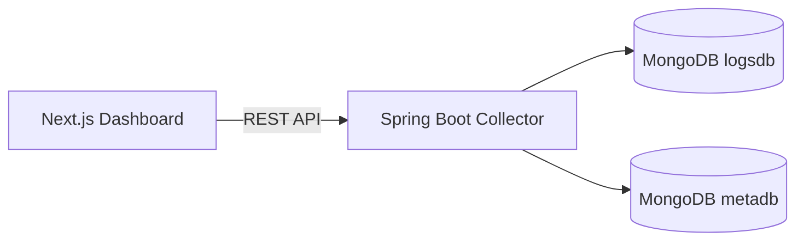

# 🚀 ProjectLeap – Real-Time API Monitoring Platform

A full-stack platform to collect, monitor, and analyze API usage across microservices in real-time.

---

### 📍 Objective
This project aims to provide:
✔ Centralized API monitoring  
✔ Real-time log tracking  
✔ Incident detection & alerting  
✔ Developer-friendly dashboards  
✔ Service performance insights  

> Built to fulfill all functionality requirements defined in the project documentation.

---

## ✨ Features (As per Requirements)

| Category | Features | Status |
|---------|----------|--------|
| Logging | Track service, endpoint, method, status, latency, timestamp | ✔ |
| Alerts | Trigger alerts on failures/slow requests | ✔ |
| Incidents | Maintain history of critical failures | ✔ |
| Authentication | JWT-secured Signup & Login | ✔ |
| Dashboard | KPIs, charts, service overview | ✔ |
| Database | Dual MongoDB (logsdb + metadb) | ✔ |
| Filtering | Logs filter by service, status | ✔ |
| Auto-Refresh | Live updates on dashboard | ✔ |
| Frontend | Modern responsive UI | ✔ |
| Evaluation Report | Testing proof included | ✔ |

---

## 🧩 System Architecture



🛠 Tech Stack
Layer | Technology
--- | ---
Frontend | Next.js 14, TypeScript, TailwindCSS, Recharts
Backend | Spring Boot 3 (Kotlin), JWT Auth
Database | MongoDB Atlas
Deployment | Localhost / Cloud ready

🔐 Authentication Flow
Register user → stored in meta database

Login → returns JWT token

Protected endpoints require Authorization header
Bearer <token>

📡 Collector Service APIs
Auth
Method | Endpoint | Description
--- | --- | ---
POST | /auth/signup | User Registration
POST | /auth/login | Login + JWT

Logs
Method | Endpoint | Description
--- | --- | ---
POST | /api/logs | Push logs
GET | /api/logs | Get logs list

Incidents
Method | Endpoint | Description
--- | --- | ---
GET | /api/incidents | Incident tracking

Alerts
Method | Endpoint | Description
--- | --- | ---
GET | /api/alerts | Alerts for Slow/Error logs

🧪 Testing (As required in submitted PDF)
✔ API authentication test
✔ Logs creation shown in logsdb
✔ Alerts triggered by slow/error logs
✔ Incident creation scenario validated
✔ Screenshots included in report

🔎 How to Run Locally
Backend
```bash
cd backend/collector-service
./gradlew bootRun
```
Frontend
```bash
cd frontend/dashboard
npm install
npm run dev
```
Open UI ➜ http://localhost:3000
Backend ➜ http://localhost:8080

🧠 Future Scope
- WebSockets for real-time updates
- Email/SMS alerts
- Role-based access
- Log export options
- AI-based reliability scoring

👨‍💻 Developer
Name | Role
--- | ---
Shreyansh Kashyap | Full Stack Developer
# Project Leap – API Monitoring & Observability Platform

## Vision
Deliver a plug-in observability layer for microservices that captures every API call, enforces per-service rate awareness, detects slow/broken endpoints in real time, and exposes all of it through a secure dashboard backed by dual MongoDB stores.

## What we built
- **API Tracking Client (Kotlin)**: reusable starter for Spring Boot services with a servlet filter and OkHttp interceptor that records endpoint, method, status, latency, timestamp, request/response sizes, service name, and rate-limit hits, then batches to the collector over REST.
- **Central Collector (Spring Boot + Kotlin)**: JWT-secured ingestion at `/api/logs/batch`, dual Mongo connections (logs + metadata), alerting rules (latency > 500ms, 5xx, rate-limit exceeded), incidents with optimistic locking, rate-limit override APIs, and service analytics.
- **Next.js Dashboard**: login/signup, protected routes, logs explorer with filters, widgets for slow/broken/rate-limited counts, alerts list, service analytics, and incident resolution UI.

## Architecture (textual)
- Services emit `LogEvent` → collector `/api/logs/batch` (bearer JWT).
- Collector writes raw traffic to the **logs** Mongo; metadata (users, rate-limit configs, alerts, incidents) to the **meta** Mongo. Two `MongoTemplate` beans + two `MongoTransactionManager`s isolate the stores.
- Alert engine evaluates each log (latency, status, rateLimited) and persists alerts/incidents in meta DB; incident resolves use optimistic locking to protect concurrent writes.
- Dashboard consumes collector REST APIs (`/api/logs`, `/api/alerts`, `/api/incidents`, `/api/rate-limit`, `/api/services`).
- Rate limiter: token-bucket default 100 rps per service; overrides are stored in meta DB and pulled by the tracker on startup. Exceeding the limit tags the log (`rateLimited=true`) but does not block the request.

## Data model highlights
- **logs (logs DB)**: service, endpoint, method, status, latencyMs, rateLimited, timestamp, requestId, requestSizeBytes, responseSizeBytes.
- **meta DB**: users; rate_limit_configs; alerts (`type`, `message`, `service`, `endpoint`, `triggeredAt`, `severity` exposed as `detectedAt`); incidents with `@Version` for optimistic locking and resolve audit.

## API surface (collector)
- `POST /auth/signup`, `POST /auth/login` → JWT.
- `POST /api/logs/batch` (auth) → list of `LogEvent`.
- `GET /api/logs` (auth) → filters for service, endpoint, status (code or bucket), slow, broken, rateLimited, errorsOnly, q, window, startTs, endTs, paging.
- `GET /api/alerts` (auth) → filter by service/endpoint/type, limit.
- `GET /api/incidents` (auth) → open incidents; `PATCH|POST /api/incidents/{id}/resolve` with `version`.
- `GET|POST /api/rate-limit` (auth) → list/upsert per-service overrides.
- `GET /api/services` (auth) → aggregates (requests, avg latency, error rate, slow/error counts) over 1h/24h/7d windows.

## Running locally
- **Backend**: set env vars `LOGS_MONGO_URI`, `META_MONGO_URI`, `JWT_SECRET` (no hardcoded credentials) then run `./gradlew :backend:collector-service:bootRun`.
- **Frontend**: `cd frontend/dashboard && npm install && npm run dev` with `NEXT_PUBLIC_API_BASE_URL=http://localhost:8080` (or your host).
- **Tracker starter**: add the `kotlin-tracker` module to your Spring Boot service and configure `monitoring.serviceName`, `monitoring.collectorUrl`, `monitoring.jwtSecret`; rate-limit defaults to 100 rps unless overridden via collector `/api/rate-limit`.

### Required environment (example)
- `LOGS_MONGO_URI=mongodb://localhost:27017/logsdb`
- `META_MONGO_URI=mongodb://localhost:27017/metadb`
- `JWT_SECRET=<generate-64+ hex or base64>`
- `NEXT_PUBLIC_API_BASE_URL=http://localhost:8080`

If using Atlas, set the URIs to your clusters; ensure the user has rights on both databases. No credentials are checked into the repo.

### Quick API testing (curl or PowerShell)
- Signup: `curl -X POST http://localhost:8080/auth/signup -H "Content-Type: application/json" -d '{"username":"you@example.com","password":"Passw0rd!"}'`
- Login (capture `token`): `curl -X POST http://localhost:8080/auth/login -H "Content-Type: application/json" -d '{"username":"you@example.com","password":"Passw0rd!"}'`
- Post logs batch:
	```bash
	curl -X POST http://localhost:8080/api/logs/batch \
		-H "Authorization: Bearer $TOKEN" \
		-H "Content-Type: application/json" \
		-d '[{"service":"collector","endpoint":"/demo","status":200,"latencyMs":120,"rateLimited":false,"timestamp":1700000000000,"requestId":"req-1","method":"GET","requestBytes":123,"responseBytes":456}]'
	```
- Query logs: `curl -H "Authorization: Bearer $TOKEN" 'http://localhost:8080/api/logs?service=collector&endpoint=/demo&size=5'`
- Alerts: `curl -H "Authorization: Bearer $TOKEN" http://localhost:8080/api/alerts`
- Rate-limit override upsert: `curl -X POST http://localhost:8080/api/rate-limit -H "Authorization: Bearer $TOKEN" -H "Content-Type: application/json" -d '{"service":"collector","limitPerSecond":20,"burst":40}'`
- Incidents: `curl -H "Authorization: Bearer $TOKEN" http://localhost:8080/api/incidents`

### Endpoint cheat sheet (all require `Authorization: Bearer <token>` unless noted)
- `POST /auth/signup` — body `{ "username": "you@example.com", "password": "Passw0rd!" }`
- `POST /auth/login` — body `{ "username": "you@example.com", "password": "Passw0rd!" }`
- `POST /api/logs/batch` — body `[{"service":"svc","endpoint":"/path","status":200,"latencyMs":100,"rateLimited":false,"timestamp":1700000000000}]`
- `GET /api/logs` — query filters: `service`, `endpoint`, `status` (code or 2xx/4xx/5xx/429), `slow`, `broken`, `rateLimited`, `errorsOnly`, `q`, `window`, `startTs`, `endTs`, `page`, `size`.
- `GET /api/alerts` — optional `service`, `endpoint`, `type`, `limit`.
- `GET /api/incidents` — list open incidents; `PATCH|POST /api/incidents/{id}/resolve` with `{ "version": <int> }`.
- `GET /api/rate-limit` — list overrides; `POST /api/rate-limit` upsert `{ "service": "svc", "limitPerSecond": 100, "burst": 200 }`.
- `GET /api/services` — aggregates; query `window` = `1h|24h|7d`.

## Outcome / verification
- Smoke tests executed: signup/login, log batch ingest, log query, alerts list, rate-limit upsert/list, incidents fetch, services aggregation (empty until data accrues). New logs appear via `/api/logs` after posting a batch.
- Concurrency protection: incident resolve uses optimistic locking with `@Version`; rate-limit upsert and user signup run under meta transactions.

## Repository layout (cleaned)
- `backend/` – collector service, tracker starter, shared contracts.
- `frontend/dashboard/` – Next.js app router UI.
- `docs/` – assignment brief (`Assignment-API-Monitoring-Observability.pdf`).
- Root: Gradle build files, Docker/Docker Compose, scripts, env sample.

```
.
├─backend
│  ├─collector-service
│  ├─kotlin-tracker
│  └─shared-contracts
├─frontend
│  └─dashboard
├─docs
│  └─Assignment-API-Monitoring-Observability.pdf
├─scripts
├─docker-compose.yml
├─Dockerfile
├─build.gradle.kts
├─settings.gradle.kts
├─gradle/
├─gradlew
├─gradlew.bat
├─vercel.json
├─.env.example
└─README.md
```

## Key decisions
- Dual Mongo via two templates/transaction managers to satisfy separation and allow independent scaling.
- Token-bucket limiter with non-blocking behavior to avoid impacting production traffic while still surfacing violations.
- MongoTemplate for flexible aggregations; optimistic locking over incidents to keep resolves safe under concurrent developers.

## Future extensions
- Add background aggregation for `/api/services` to reduce query-time work.
- Wire alert notifications to email/Slack.
- Add synthetic load tests to validate 50+ concurrent ingest batches in CI.
